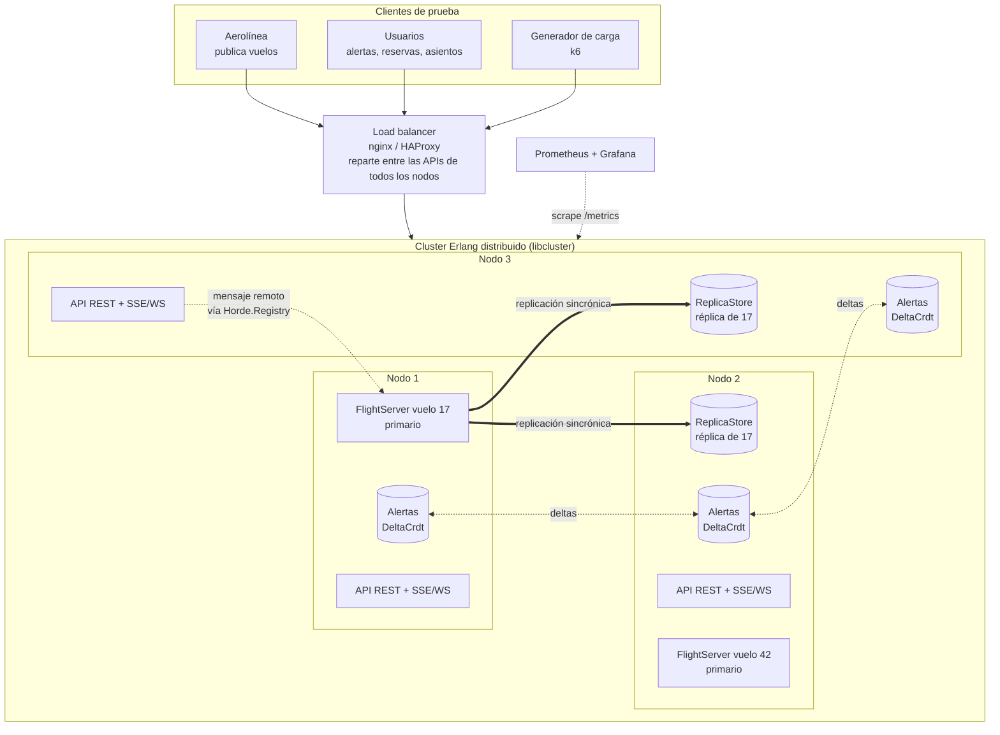
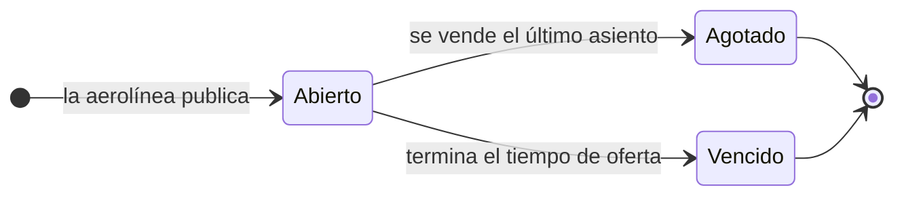
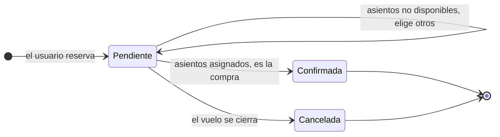
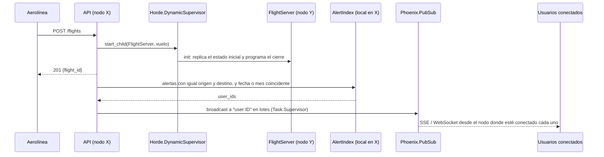
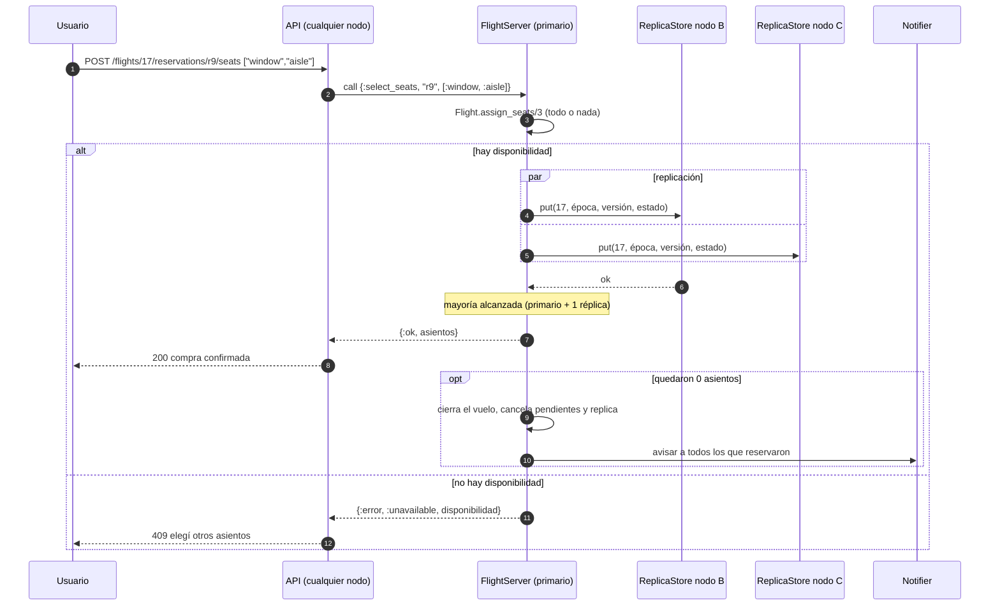
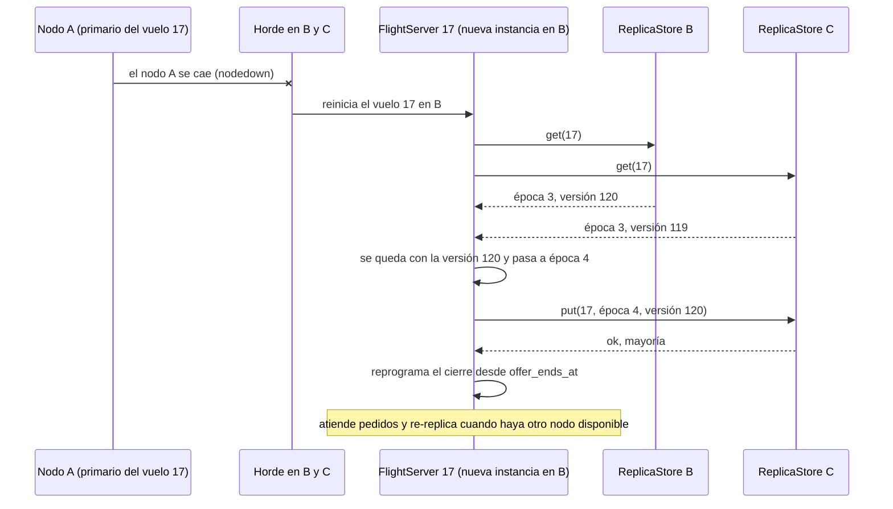

# Levantar Vuelo: propuesta de arquitectura

TP grupal IASC 2C2026. Documento de trabajo para elegir la arquitectura y la estrategia de implementación.
Lo marcado como **[a validar]** depende de respuestas del tutor (ver [§10](#10-preguntas-para-el-tutor)) o de mediciones.

## 0. Resumen

- **Tecnología recomendada: Elixir/OTP.** Casi todos los requerimientos no funcionales (estado distribuido, tolerancia a fallos, escalado en nodos, notificaciones en tiempo real) se resuelven con primitivas que la plataforma ya trae: procesos/actores, supervisores, Erlang distribuido, PubSub. En Node.js esas piezas (membresía del cluster, detección de caídas, ruteo entre nodos, reinicio de lo que se cayó) hay que construirlas o traerlas de afuera.
- **Idea central: un actor por vuelo.** El vuelo es la unidad de consistencia. Todas las reservas y asignaciones de asientos de un vuelo pasan por un único proceso (`FlightServer`) que las procesa de a una. Así no hay doble venta sin locks ni transacciones distribuidas, y vuelos distintos se procesan en paralelo en cualquier nodo.
- **Estado distribuido y replicado en memoria.** Cada `FlightServer` replica su estado a otros nodos antes de confirmar una operación (factor de replicación 3, confirmación por mayoría). Si se cae un nodo, el vuelo se reinicia en otro y recupera el estado desde las réplicas.
- **CAP según el tipo de dato.** Vuelos, asientos y reservas son **CP**: preferimos rechazar una operación antes que vender dos veces el mismo asiento. Alertas y notificaciones son **AP**: se replican con un CRDT, y que una alerta tarde unos milisegundos en propagarse no rompe nada.
- **Estrategia:** arrancar con una prueba de concepto corta del cluster (3 nodos en Docker, matar uno y ver que el actor se recupera sin perder estado). Si sale dentro del tiempo que nos demos, seguimos con Elixir. Si no, pasamos al plan B en Node.js ([§5](#5-escenario-alternativo-nodejs)), sabiendo que implica bastante más código de infraestructura.

## 1. Lectura del enunciado

### Requerimientos funcionales

| # | Requerimiento | Observaciones |
|---|---|---|
| F1 | Las aerolíneas publican vuelos: tipo de avión, asientos por tipo (ventana, pasillo, medio), fecha y hora, origen, destino, tiempo de oferta | El tiempo de oferta se convierte en un instante absoluto de cierre |
| F2 | Los interesados crean alertas: fecha y/o mes, origen, destino | |
| F3 | Al publicarse un vuelo se notifica a todos los que tienen una alerta que coincide | Fan-out potencialmente masivo |
| F4 | Los interesados reservan vuelos | Se permite reservar por encima de la capacidad (overbooking) |
| F5 | Con la reserva hecha, se eligen asientos por tipo (ventana, pasillo o cualquiera; p. ej. 2 ventanas + 1 pasillo). Si no hay disponibilidad, se pide elegir de nuevo. Asiento confirmado = compra | Operación crítica: nunca vender dos veces |
| F6 | Al vencer el tiempo de oferta el vuelo se cierra y se cancelan las reservas sin asiento | Timer que tiene que sobrevivir a la caída de un nodo |
| F7 | Al venderse todos los asientos el vuelo se cierra | |
| F8 | Al cerrarse un vuelo se notifica a todos los que reservaron y se cancelan las reservas pendientes | |

### Requerimientos no funcionales

| Requerimiento | Qué pide | Qué implica en el diseño |
|---|---|---|
| Tiempo real | Operaciones rápidas, que no dependan sustancialmente de la red ni de cuánta gente compite por el pasaje | Notificaciones push (SSE/WebSocket), contención acotada a un vuelo, sin locks globales |
| En memoria | Nada de persistencia en disco | Sin base de datos: la durabilidad sale de replicar entre nodos |
| Escalabilidad | Agregar y quitar nodos según la demanda (manual; automático es bonus) | Nodos simétricos, rebalanceo al entrar o salir un nodo |
| Monitoreo | Poder detectar los picos | Métricas y dashboard |
| Redundancia | Estado distribuido; si se cae un nodo, restaurarlo desde los demás sin perder reservas | Replicación en memoria y failover |
| Despliegue | Docker deseable, opcional | docker compose |

### Qué se evalúa

Cumplimiento de los requerimientos, uso adecuado de la tecnología y de los conceptos de la materia, arquitectura y estado distribuidos, y **la justificación**: modelo de concurrencia, prioridades de CAP, manipulación de los datos y recuperación de nodos. La [§9](#9-cómo-cubre-esto-la-evaluación) relaciona cada criterio con la parte del diseño que lo cubre.

### Supuestos

Hasta que el tutor responda ([§10](#10-preguntas-para-el-tutor)) asumimos:

- Una reserva puede incluir varios asientos. La cantidad y los tipos se definen al elegir asientos, no al reservar.
- Los asientos se asignan por **tipo**, no por número.
- "Cualquiera" puede terminar siendo ventana, pasillo o medio.
- La reserva no tiene un vencimiento propio: sólo se cancela cuando se cierra el vuelo.
- Modelo de fallas: caídas de nodos (crash-stop). Las particiones de red se contemplan con quorum ([§3.7](#37-cap-decisión-por-tipo-de-dato)), pero no son el foco.

## 2. Idea central: el vuelo como unidad de consistencia

El único invariante duro del dominio es **no vender más asientos de un tipo que los disponibles**. Ese invariante vive dentro de un vuelo: ninguna operación involucra dos vuelos a la vez. De ahí sale el diseño:

- Cada vuelo es un **actor** (un `GenServer`). Su mailbox es la cola de pedidos y procesa un mensaje por vez, así que "chequear disponibilidad y asignar" es atómico sin locks.
- Vuelos distintos son actores distintos: se procesan en paralelo en todos los cores y nodos, y un vuelo muy demandado no frena a los demás.
- No hacen falta transacciones distribuidas. La consistencia es local a un actor. Lo que se distribuye es *dónde vive* cada actor y *dónde están sus réplicas*.

¿Es un cuello de botella un único actor con miles de usuarios encima? Cada operación es una actualización de un mapa en memoria, del orden de microsegundos, así que un proceso puede atender decenas de miles de operaciones por segundo **[a medir]**. El costo real es la replicación sincrónica (una ida y vuelta por la red en cada escritura). En [§3.8](#38-tiempo-real-y-contención) está cómo se amortiza.

## 3. Arquitectura propuesta (Elixir/OTP)

### 3.1 Vista general



Todos los nodos son iguales: no hay un master. Cualquier nodo recibe cualquier request, y si el vuelo vive en otro nodo el mensaje viaja por Erlang distribuido sin que la API se entere. En el diagrama sólo se dibuja la replicación del vuelo 17; todos los vuelos funcionan igual (el 42, por ejemplo, tendría sus réplicas en los nodos 1 y 3).

### 3.2 Componentes de cada nodo

| Componente | Responsabilidad | Tecnología |
|---|---|---|
| API REST | Endpoints de [§3.11](#311-api), valida y delega | Phoenix sin Ecto (`mix phx.new levantar_vuelo --no-ecto --no-html --no-assets`) o Plug + Bandit |
| Push de notificaciones | Un stream por usuario conectado | SSE o Phoenix Channels (WebSocket) |
| `FlightServer` (uno por vuelo) | Estado del vuelo, reservas, asignación de asientos, timer de oferta, cierre | `GenServer` |
| Registro y supervisor distribuidos | Nombre global `{:flight, id}` → pid; decide en qué nodo corre cada vuelo y lo reinicia en otro si su nodo se cae | `Horde.Registry` + `Horde.DynamicSupervisor` |
| `ReplicaStore` | Guarda réplicas (estado, versión, época) de vuelos cuyo primario está en otro nodo | `GenServer` + ETS |
| `AlertIndex` | Alertas replicadas en todos los nodos, indexadas por (origen, destino) | `DeltaCrdt` (AWLWWMap) + ETS local para buscar |
| `Notifier` | Fan-out de notificaciones sin bloquear al `FlightServer` | `Task.Supervisor` + `Phoenix.PubSub` |
| Inbox (opcional) | Notificaciones pendientes para usuarios desconectados | `DeltaCrdt` |
| Cluster | Descubrimiento de nodos | libcluster (`DNSPoll` en Docker, `Epmd` o `Gossip` en local) |
| Métricas | Exponer métricas y ver el estado de la VM | Telemetry, PromEx o `telemetry_metrics_prometheus`, LiveDashboard |

Árbol de supervisión simplificado:

```
LevantarVuelo.Supervisor (one_for_one)
├── Cluster.Supervisor               libcluster
├── Phoenix.PubSub
├── LevantarVuelo.Registry           Horde.Registry, members: :auto
├── LevantarVuelo.FlightSupervisor   Horde.DynamicSupervisor, members: :auto
│   └── FlightServer × N
├── LevantarVuelo.ReplicaStore
├── LevantarVuelo.Alerts.Supervisor
│   ├── DeltaCrdt
│   └── AlertIndex (ETS)
├── Task.Supervisor                  Notifier
├── Telemetry
└── Endpoint HTTP                    último: arranca cuando lo demás está listo
```

### 3.3 Modelo de datos y estados

```elixir
%Flight{
  id: "fl_17", airline: "...", aircraft: "Embraer 190",
  origin: "EZE", destination: "MAD", departs_at: ~U[2026-12-20 22:00:00Z],
  offer_ends_at: ~U[2026-10-01 18:30:00Z],   # absoluto: sobrevive al failover
  capacity:  %{window: 40, aisle: 40, middle: 20},
  available: %{window: 3,  aisle: 0,  middle: 5},
  reservations: %{"r9" => %{user_id: "u1", status: :pending, seats: []}},
  status: :open,                             # | {:closed, :sold_out | :expired}
  epoch: 3, version: 120                     # para la replicación (§3.6)
}

%Alert{id: "al_5", user_id: "u1", origin: "EZE", destination: "MAD",
       date: nil, month: {2026, 12}}         # fecha puntual y/o mes
```

Ciclo de vida del vuelo:



Ciclo de vida de una reserva:



**Asignación de asientos (todo o nada):**

1. Primero los pedidos de un tipo específico (ventana, pasillo).
2. Después los "cualquiera", empezando por los del medio. Así quedan ventanas y pasillos para quien los pide explícitamente, lo que ayuda a vender el vuelo completo, que es el objetivo de la empresa.
3. Si algo no alcanza, no se asigna nada y se responde `409` con la disponibilidad actual para que el usuario vuelva a elegir.
4. Si la disponibilidad queda en cero, el vuelo se cierra como agotado.

Conviene separar la lógica pura del proceso: `Flight.reserve/2`, `Flight.assign_seats/3` y `Flight.close/2` reciben un estado y devuelven otro, y el `FlightServer` sólo se ocupa de mensajes, replicación y timers. La lógica pura se testea sin procesos ni cluster.

### 3.4 Flujos principales

**Publicación de un vuelo y notificación de alertas (F1–F3):**



**Elección de asientos (F5, F7, F8):**



**Cierre por tiempo (F6, F8):** el `FlightServer` programa `Process.send_after(self(), :offer_expired, ms)` calculando `ms` desde `offer_ends_at`. Al recibir el mensaje cancela las reservas pendientes, replica el estado cerrado y delega las notificaciones al `Notifier`. Como el cierre se guarda como instante absoluto, una instancia que arranca por failover vuelve a calcular cuánto falta, o cierra en el momento si ya pasó.

**Escenario del enunciado (A, B y C):** el vuelo X tiene una ventana y un pasillo. A y B reservan. B pide ventana y compra. C reserva (hay overbooking). A pide ventana y recibe `409` porque ya no quedan. C pide "cualquiera", recibe el pasillo y compra. Quedan 0 asientos: el vuelo se cierra, se cancela la reserva de A y se le notifica. Todo esto pasa por la mailbox de un único actor, así que el orden es el de llegada y no hay carreras. Este escenario debería ser un test automatizado.

### 3.5 Distribución: dónde vive cada vuelo

- **libcluster** conecta los nodos automáticamente.
- **`Horde.DynamicSupervisor`** decide en qué nodo arranca cada `FlightServer` (distribución uniforme por hash) y, si ese nodo se cae, lo reinicia en otro. Con `process_redistribution: :active`, cuando entra un nodo nuevo se le mueven vuelos.
- **`Horde.Registry`** da el nombre global `{:via, Horde.Registry, {LevantarVuelo.Registry, {:flight, id}}}`. La API hace `GenServer.call(via(id), mensaje)` sin saber en qué nodo está el proceso.
- Horde es eventualmente consistente (está construido sobre CRDTs). Durante una partición puede haber dos instancias del mismo vuelo. Eso no rompe el invariante porque la garantía la da la replicación con quorum y épocas ([§3.6](#36-replicación-y-recuperación-ante-fallos)), no Horde. Horde también ofrece `Horde.UniformQuorumDistribution`, que sólo corre procesos del lado con mayoría: sirve como capa adicional **[a validar su comportamiento con membresía dinámica]**.

### 3.6 Replicación y recuperación ante fallos

Requisito: si se cae un nodo, restaurar su estado desde los otros sin perder reservas y sin escribir en disco.

**Esquema primario-réplicas con escritura sincrónica:**

1. El `FlightServer` (primario) aplica la operación en memoria.
2. Envía el estado nuevo, con `{época, versión}`, a los `ReplicaStore` de los R-1 nodos que le tocan según un hash ring del cluster (libring, `HashRing.key_to_nodes/3`). Se hace con `GenServer.multi_call/4`.
3. Responde al cliente **sólo cuando confirmó la mayoría**, contándose a sí mismo. Con R = 3 alcanza con el primario y una réplica. Toda compra confirmada existe en al menos dos nodos.

**Failover** (se cae el nodo donde vivía el primario):



1. Los demás nodos detectan la caída (`:nodedown`). Si el contenedor muere, la conexión se cierra y la detección es inmediata. Para cuelgues de red decide `net_ticktime` (60 s por defecto), así que conviene bajarlo, por ejemplo a 10 s en `vm.args`.
2. Horde reinicia en otro nodo los `FlightServer` que vivían en el nodo caído.
3. En `init/1` el `FlightServer` pide su estado a todos los `ReplicaStore`, se queda con la versión más alta, incrementa la época y la registra en la mayoría antes de atender.
4. Reprograma el timer de cierre.
5. Vuelve a replicar a los nodos que ahora le tocan para recuperar las R copias.

**Nodo nuevo o que vuelve:** arranca vacío y entra al cluster. Recibe réplicas cuando los primarios recalculan su conjunto de réplicas, y Horde le asigna vuelos que recuperan su estado desde las réplicas. Así el nodo se "restaura a partir de los restantes".

**Épocas (fencing):** cada instancia nueva de un primario toma "época máxima conocida + 1". Las réplicas rechazan escrituras con una época menor a la última que vieron. Un primario viejo (aislado en una partición, o un duplicado de Horde) no junta mayoría y no puede confirmar compras. Al recibir el rechazo se deja caer y se reinicia desde las réplicas: *let it crash*.

**Idempotencia:** los pedidos de escritura llevan un `request_id`. Si un cliente reintenta después de un failover porque no sabe si su compra se hizo, el `FlightServer` detecta el id repetido y devuelve el resultado anterior en vez de asignar asientos otra vez.

**Qué se replica y cómo:**

| Dato | Replicación |
|---|---|
| Vuelos, reservas y asientos | Sincrónica, primario + réplicas, R = 3, confirmación por mayoría |
| Alertas | `DeltaCrdt` en todos los nodos: asincrónica, converge en milisegundos. Hay que actualizar los vecinos con `DeltaCrdt.set_neighbours/2` al entrar o salir nodos |
| Conexiones SSE/WebSocket | No se replican: el cliente reconecta a otro nodo |
| Inbox de notificaciones | Opcional, `DeltaCrdt` |

### 3.7 CAP: decisión por tipo de dato

Ante una partición de red no se puede tener consistencia y disponibilidad a la vez. Lo decidimos por tipo de dato:

| Dato | Elección | Motivo | Comportamiento durante una partición |
|---|---|---|---|
| Asientos y compras | **CP** | Vender dos veces un asiento es el peor error posible para el negocio | El lado sin mayoría no confirma compras de los vuelos afectados: responde 503 y el cliente reintenta. Los vuelos cuyo primario y réplicas quedaron del mismo lado siguen funcionando |
| Reservas sin asiento | **CP** (pasan por el mismo actor) | Simplicidad, y hace falta la lista completa para cancelar y notificar al cierre. El overbooking permitiría AP, pero no vale la complejidad | Igual que los asientos |
| Alertas | **AP** | Crear una alerta siempre debería funcionar. Si tarda en propagarse, lo peor que pasa es que se pierda el aviso de un vuelo publicado justo en ese instante | Los dos lados aceptan alertas y el CRDT las fusiona al reconectarse |
| Notificaciones | **AP**, best-effort | Son avisos: el estado real se consulta en la API | Se entregan cuando el usuario reconecta (con inbox) o se pierden (sin inbox) |
| Ubicación de procesos (Horde) | **AP** con resolución de conflictos | Mantener el ruteo disponible; los duplicados se neutralizan con las épocas | Puede haber duplicados temporales; al sanar, Horde termina uno |

Sin particiones (el caso normal, y el de las pruebas en que se cae un nodo) el sistema es consistente y disponible. Un vuelo sólo está sin servicio durante la detección de la caída, el reinicio y la recuperación desde réplicas.

Consistencia dentro de un vuelo: linealizable, porque un único actor serializa las operaciones. Entre vuelos no hace falta coordinar nada.

### 3.8 Tiempo real y contención

- **Push, no polling:** las notificaciones llegan por SSE o WebSocket.
- **Contención localizada:** miles de usuarios peleando por un vuelo sólo cargan a ese actor. El scheduler preemptivo de la BEAM evita que un vuelo muy demandado o un fan-out grande suban la latencia del resto.
- **El `FlightServer` no hace trabajo pesado:** el fan-out de notificaciones va a un `Task.Supervisor`.
- **Replicación sin frenar al actor (optimización):** en vez de esperar el ack de cada escritura antes de procesar el siguiente mensaje, el actor aplica la operación, envía la réplica con un número de secuencia, guarda el `from` del cliente y sigue. Cuando llega la mayoría para la secuencia *n*, responde con `GenServer.reply/2` a todos los pendientes hasta *n*. El throughput de un vuelo deja de depender de la latencia de red y ninguna respuesta sale antes de estar replicada. Conviene empezar con la versión simple (sincrónica) y pasar a esta sólo si las pruebas de carga lo piden.
- **Descarte de carga (opcional):** si la mailbox de un vuelo supera un umbral, responder 503 de inmediato en lugar de encolar sin límite.

### 3.9 Escalado y monitoreo

**Métricas mínimas** (Telemetry exportado a Prometheus y visto en Grafana; LiveDashboard sirve para empezar):

- requests por segundo y latencia p95/p99 por endpoint y por nodo
- vuelos activos por nodo, reservas y compras por segundo
- largo máximo de mailbox de los `FlightServer`, que mide directamente la contención
- notificaciones enviadas por segundo
- nodos en el cluster, memoria y run queue de la BEAM
- vuelos con menos de R réplicas: indica si es seguro quitar un nodo

Un pico se detecta con reglas simples, por ejemplo requests por segundo por nodo o p95 por encima de un umbral durante N segundos.

**Agregar un nodo:** `docker compose up -d --scale app=N+1`. libcluster lo conecta, Horde le reasigna vuelos y esos vuelos recuperan el estado desde las réplicas.

**Quitar un nodo:** de a uno por vez, y sólo cuando no hay vuelos con réplicas faltantes. Al recibir SIGTERM el nodo sale del load balancer, Horde mueve sus vuelos y los primarios re-replican.

**Bonus, escalado automático:** un proceso que consulta Prometheus y escala hacia arriba o abajo con histéresis (umbrales distintos para subir y bajar, y un tiempo de enfriamiento entre cambios).

### 3.10 Despliegue

docker compose con `app` (release de Elixir, escalable), `lb` (nginx o HAProxy), `prometheus` y `grafana`.

Detalles de Erlang distribuido en Docker que conviene resolver en la prueba de concepto:

- Nombre de nodo único por contenedor: `RELEASE_DISTRIBUTION=name` y `RELEASE_NODE=levantar@<ip del contenedor>`, configurado en `rel/env.sh.eex`.
- Misma cookie en todos los nodos (`RELEASE_COOKIE`).
- libcluster con `Cluster.Strategy.DNSPoll` apuntando al nombre del servicio `app`.
- Ningún componente escribe a disco datos del negocio. Prometheus sí guarda métricas en disco, pero son datos operativos, no reservas **[a validar]**.

### 3.11 API

| Método | Ruta | Descripción | Respuestas |
|---|---|---|---|
| `POST` | `/flights` | Publica un vuelo | `201 {flight_id}` |
| `GET` | `/flights/:id` | Estado y disponibilidad | `200` |
| `POST` | `/alerts` | Crea una alerta | `201 {alert_id}` |
| `DELETE` | `/alerts/:id` | Borra una alerta | `204` |
| `POST` | `/flights/:id/reservations` | Reserva | `201 {reservation_id}`, `410` si el vuelo está cerrado |
| `POST` | `/flights/:id/reservations/:rid/seats` | Elige asientos, p. ej. `{"seats": ["window", "window", "aisle"]}` | `200` compra confirmada, `409` sin disponibilidad (incluye la disponibilidad actual), `410` reserva cancelada |
| `GET` | `/users/:id/notifications` | Stream SSE (o canal WebSocket `user:ID`) | stream |
| `GET` | `/cluster` | Nodos, vuelos por nodo, réplicas (para la demo) | `200` |
| `GET` | `/metrics` | Métricas para Prometheus | `200` |

El `flight_id` va en la ruta de la reserva para poder rutear directo al actor del vuelo.

### 3.12 Esqueleto del `FlightServer`

```elixir
defmodule LevantarVuelo.FlightServer do
  use GenServer, restart: :transient
  alias LevantarVuelo.{Flight, Replication}

  def start_link({id, _initial} = args),
    do: GenServer.start_link(__MODULE__, args, name: via(id))

  def via(id), do: {:via, Horde.Registry, {LevantarVuelo.Registry, {:flight, id}}}

  def select_seats(id, reservation_id, seats),
    do: GenServer.call(via(id), {:select_seats, reservation_id, seats})

  @impl true
  def init({id, initial}) do
    # Arranque normal o failover: si hay réplicas, manda la versión más nueva.
    state = Replication.recover(id) || initial
    Process.send_after(self(), :offer_expired, ms_until(state.offer_ends_at))
    {:ok, state}
  end

  @impl true
  def handle_call({:select_seats, rid, wanted}, _from, state) do
    case Flight.assign_seats(state, rid, wanted) do
      {:ok, new_state, seats} ->
        # Sin mayoría el match falla y el proceso se cae: se reinicia desde las réplicas.
        :ok = Replication.replicate(new_state)
        {:reply, {:ok, seats}, new_state, {:continue, :maybe_close}}

      {:error, reason} ->
        {:reply, {:error, reason}, state}
    end
  end

  # handle_continue(:maybe_close, ...) y handle_info(:offer_expired, ...) cierran el
  # vuelo con Flight.close/2, replican y delegan las notificaciones al Notifier.
end
```

```elixir
defmodule LevantarVuelo.Replication do
  @replicas 3
  @quorum div(@replicas, 2) + 1

  def replicate(%{id: id, epoch: epoch, version: version} = state) do
    {replies, _bad_nodes} =
      GenServer.multi_call(replica_nodes(id), LevantarVuelo.ReplicaStore,
                           {:put, id, epoch, version, state}, 500)

    acks = Enum.count(replies, fn {_node, reply} -> reply == :ok end)
    if acks + 1 >= @quorum, do: :ok, else: {:error, :no_quorum}
  end

  # recover/1: multi_call {:get, id} a todos los nodos, se queda con la versión más
  # alta, incrementa la época y la registra en la mayoría antes de devolver el estado.
end
```

## 4. Otras alternativas consideradas

| Alternativa | A favor | En contra | Veredicto |
|---|---|---|---|
| Mnesia con `ram_copies` | Viene con OTP; replicación y transacciones en memoria | Maneja mal las particiones (quedan islas inconsistentes que hay que fusionar a mano), contención de locks en un vuelo muy demandado, y esconde justo lo que se evalúa: cómo se replica y se recupera | Plan B para la replicación si la propia se complica |
| CRDT para los asientos | Siempre disponible (AP) | Un CRDT no garantiza "vendidos ≤ capacidad" sin coordinación, así que habría doble venta. Existen contadores acotados (escrow), pero complican "cualquier asiento" | Descartado |
| Raft por vuelo (`ra`, `raft_fleet`) | Consistencia fuerte "de libro" | `ra` escribe su log en disco; otras librerías tienen mantenimiento incierto; es mucho para un TP | Descartado. Vale mencionarlo en la defensa como la solución "industrial" |
| Store externo en memoria (Redis sin persistencia, Hazelcast) | Resuelve la replicación | El enunciado pide que el estado esté distribuido entre los nodos de *nuestra* aplicación, y delega justo lo que se evalúa | Consultar al tutor. No recomendado |
| Un actor por asiento | Más paralelismo | "Cualquier asiento" y "2 ventanas + 1 pasillo" exigen atomicidad entre varios asientos, lo que obliga a coordinar actores | Descartado |

## 5. Escenario alternativo: Node.js

Es viable, pero cambia dónde va el esfuerzo. El modelo de concurrencia es event loop + Promises (`async`/`await`). Dentro de un proceso Node no hay paralelismo, y un bloque de código sincrónico es atómico; eso se puede usar para emular actores. El dominio y la estrategia de replicación son los mismos; lo que cambia es la infraestructura.

| Pieza en Elixir | Equivalente en Node.js |
|---|---|
| `GenServer` por vuelo | Clase `FlightActor` con una mailbox hecha con una cadena de Promises, para serializar operaciones aunque tengan `await` adentro |
| Erlang distribuido | HTTP/gRPC interno, o el transporter TCP de Moleculer (descubrimiento por gossip, sin broker) |
| libcluster | Service discovery de Moleculer, o lista de peers + heartbeats propios |
| Horde (ubicación y reinicio) | Hash ring propio (o la estrategia `Shard` de Moleculer) + promoción de la réplica sucesora cuando se detecta una caída |
| Supervisores | Restart policy de Docker o PM2: reinician el proceso entero, no un actor |
| `Phoenix.PubSub` | Eventos de Moleculer, o pub/sub de Redis/NATS |
| `DeltaCrdt` para alertas | Broadcast de alertas a todos los nodos, o un CRDT propio |
| Telemetry/PromEx | `prom-client` o las métricas de Moleculer |
| Scheduler preemptivo | No existe: un fan-out de 100.000 notificaciones bloquea el event loop si no se parte en lotes (`setImmediate`) |

```ts
class FlightActor {
  private mailbox: Promise<unknown> = Promise.resolve();

  // Serializa las operaciones del vuelo aunque tengan await adentro (p. ej. replicar).
  private enqueue<T>(op: () => Promise<T>): Promise<T> {
    const result = this.mailbox.then(op);
    this.mailbox = result.catch(() => undefined);
    return result;
  }

  selectSeats(reservationId: string, wanted: SeatType[]) {
    return this.enqueue(async () => {
      const next = assignSeats(this.state, reservationId, wanted); // lógica pura; lanza si no hay
      await this.replication.replicate(next);                      // espera la mayoría
      this.state = next;
      return next.reservations[reservationId].seats;
    });
  }
}
```

Un detalle que simplifica el failover en Node: si las réplicas son los sucesores del primario en el hash ring, cuando el primario se cae el sucesor ya tiene el estado y se promueve sin transferir nada.

**A favor:** curva de aprendizaje baja si el equipo sabe JS/TS, buen ecosistema para HTTP y WebSocket, TypeScript.

**En contra:** hay que escribir membresía, detección de caídas, ruteo, rebalanceo, reinicio y manejo de split-brain, lo que significa más código y bugs más sutiles. Aprovechar varios cores requiere varios procesos. Una excepción no capturada tira el proceso completo con todos sus vuelos, no un solo actor.

## 6. Comparación y recomendación

| Criterio | Elixir/OTP | Node.js |
|---|---|---|
| Actor por vuelo | Nativo: `GenServer`, mailbox, fallas aisladas | Emulado con una cola de Promises |
| Comunicación entre nodos | Nativa y transparente (Erlang distribuido) | A construir (HTTP/gRPC) o Moleculer |
| Membresía y detección de caídas | libcluster + `:nodedown` | Moleculer o heartbeats propios |
| Reubicar y reiniciar procesos en otro nodo | Horde | Propio |
| Replicación del estado | Propia, con `multi_call` | Propia, con HTTP/RPC |
| Notificaciones distribuidas | `Phoenix.PubSub` + Channels/SSE | Eventos de Moleculer o Redis/NATS + ws/SSE |
| Uso de varios cores | Automático | Un proceso por core |
| Latencia con carga despareja | Scheduler preemptivo | Hay que cuidar no bloquear el event loop |
| Monitoreo | Telemetry, PromEx, LiveDashboard (muestra procesos y mailboxes) | `prom-client` |
| Curva de aprendizaje | Más alta | Baja si el equipo sabe JS/TS |
| Encaje con la materia | Alto: actores, supervisión, distribución | Medio: Promises; actores y distribución hechos a mano |
| Código de infraestructura propio | Poco | Mucho |

**Recomendación: Elixir/OTP.** La parte difícil del TP (replicar el estado de un vuelo y recuperarlo) hay que escribirla a mano en cualquiera de las dos opciones. Elixir resuelve el resto (cluster, ruteo, supervisión, reinicio en otro nodo, PubSub distribuido) y deja más tiempo para lo que se evalúa. Además, la justificación del modelo de concurrencia queda más natural: actores, supervisión y *let it crash*. Node.js tiene sentido si nadie del grupo puede dedicarle tiempo a aprender Elixir, o si el tutor habilita un store externo que absorba la distribución.

## 7. Estrategia de trabajo

### Iteraciones

Cada iteración termina con algo que se puede mostrar.

| # | Iteración | Resultado |
|---|---|---|
| 0 | **Prueba de concepto del cluster** (tiempo acotado) | 3 nodos en docker compose con libcluster + Horde; un `GenServer` contador replicado a mano; `docker kill` a un nodo y el contador sigue en otro sin perder el valor. **Es el criterio para decidir entre Elixir y Node** |
| 1 | Dominio en un nodo | Módulo `Flight` puro con tests (incluido el escenario A/B/C), `FlightServer`, timer de oferta, API REST |
| 2 | Alertas y notificaciones | `AlertIndex`, matching, PubSub, SSE/WebSocket, clientes de prueba (aerolínea y usuario) |
| 3 | Distribución | Horde (registro y supervisor), ruteo desde cualquier nodo, load balancer |
| 4 | Replicación y failover | `ReplicaStore`, épocas, recuperación en `init`, re-replicación, idempotencia, pruebas de caos |
| 5 | Escalado y monitoreo | Métricas, dashboard, escalado manual, pruebas de carga; escalado automático si sobra tiempo |
| 6 | Documentación y demo | Diagramas, justificación de CAP, guion de la demo |

Las iteraciones 0 y 1 se pueden hacer en paralelo: la lógica pura del dominio no depende del cluster.

### División sugerida del trabajo

Ajustar al tamaño del grupo:

- **Dominio + API:** `Flight`, `FlightServer`, endpoints.
- **Distribución + replicación:** Horde, `ReplicaStore`, failover. Es la parte más difícil; conviene que la hagan dos personas.
- **Alertas + notificaciones + clientes de prueba.**
- **Infraestructura:** Docker, monitoreo, pruebas de carga y de caos.

### Riesgos

| Riesgo | Mitigación |
|---|---|
| Curva de aprendizaje de Elixir/OTP | Prueba de concepto al principio, lógica pura primero, pair programming |
| Erlang distribuido en Docker (nombres de nodo, cookie, DNS) | Resolverlo en la iteración 0 |
| Sutilezas de Horde (redistribución, duplicados en particiones) | No depender de Horde para la consistencia (épocas + quorum); tests multi-nodo |
| Bugs en la replicación (pérdidas o duplicados) | Tests de propiedades, pruebas de caos y un verificador de invariantes |
| Querer resolver particiones "perfecto" | Declarar el modelo de fallas y documentar las limitaciones |
| Escalado automático | Es bonus: sólo después de lo obligatorio |

## 8. Pruebas

- **Unitarias** del dominio puro, incluido el escenario A/B/C del enunciado.
- **De propiedades** (StreamData): para cualquier secuencia de operaciones, vendidos ≤ capacidad por tipo; cada compra tiene exactamente los asientos pedidos; un vuelo cerrado no tiene reservas pendientes.
- **Multi-nodo** en ExUnit (LocalCluster): matar un nodo y verificar que las compras confirmadas siguen existiendo.
- **Caos en Docker:** carga continua y `docker kill` a un nodo al azar. Al final se comparan las compras que los clientes vieron confirmadas con el estado del sistema.
- **Carga:** un vuelo de 180 asientos y 5.000 usuarios virtuales reservando y eligiendo asientos. Se mide el p95 y se verifica que lo vendido sea igual a la capacidad.

## 9. Cómo cubre esto la evaluación

| Criterio | Dónde está cubierto |
|---|---|
| Cumplimiento de requerimientos | F1–F8 en [§3.3](#33-modelo-de-datos-y-estados) y [§3.4](#34-flujos-principales); escenario A/B/C como test |
| Uso adecuado de la tecnología y los conceptos | Actores (`GenServer` por vuelo), supervisión y *let it crash*, paso de mensajes local y remoto, CRDTs, PubSub |
| Arquitectura y estado distribuidos | Nodos simétricos, vuelos repartidos por Horde, réplicas en otros nodos, alertas replicadas |
| Modelo de concurrencia | [§2](#2-idea-central-el-vuelo-como-unidad-de-consistencia) y [§3.8](#38-tiempo-real-y-contención) |
| Aspectos de CAP | [§3.7](#37-cap-decisión-por-tipo-de-dato) |
| Manipulación de los datos | Escritor único por vuelo, replicación con versiones y épocas, idempotencia |
| Recuperación de nodos | [§3.6](#36-replicación-y-recuperación-ante-fallos): failover, re-replicación, nodo nuevo |
| Documentación y diagramas | Este documento |
| Tests automatizados (plus) | [§8](#8-pruebas) |

## 10. Preguntas para el tutor

1. ¿Se puede usar un store externo en memoria (por ejemplo Redis sin persistencia), o el estado tiene que vivir en los nodos de nuestra aplicación? Asumimos lo segundo.
2. ¿Hay que contemplar particiones de red, o alcanza con caídas de nodos? ¿Cuántas caídas simultáneas hay que tolerar? Eso define el factor de replicación.
3. ¿Una reserva puede ser para varios pasajeros? ¿La cantidad se fija al reservar o al elegir asientos? ¿Un usuario puede tener varias reservas del mismo vuelo?
4. ¿Alcanza con asignar asientos por tipo, o hay que asignar números de asiento?
5. ¿Las notificaciones a usuarios desconectados hay que guardarlas (inbox) o alcanza con best-effort?
6. ¿Es aceptable usar Prometheus y Grafana, que guardan métricas en disco, dado el requisito de trabajar en memoria?
7. En las alertas, "fecha y/o mes": ¿si se indican las dos cosas, tienen que coincidir ambas?
